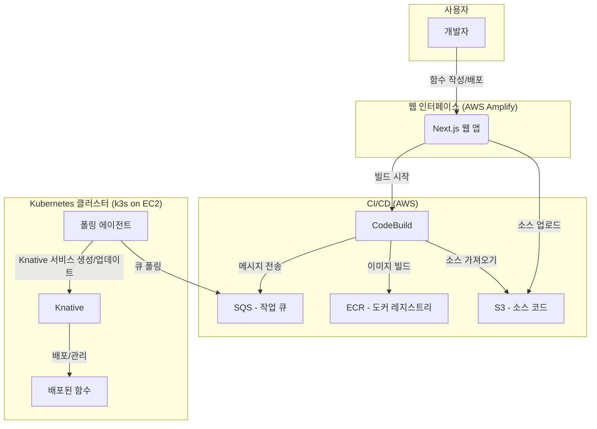
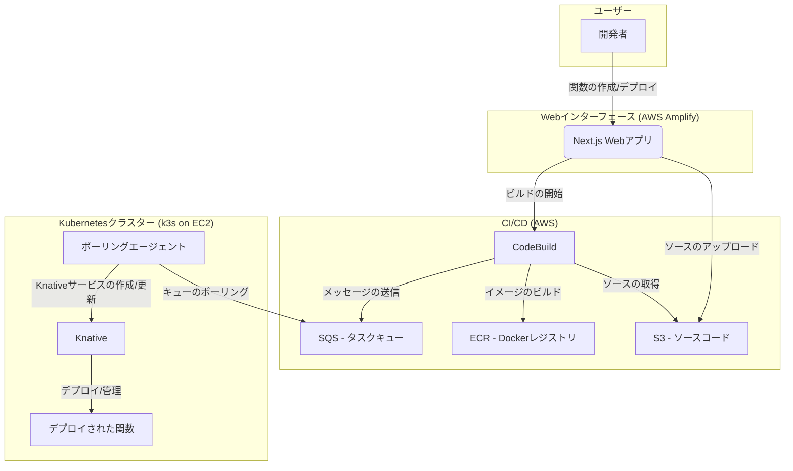
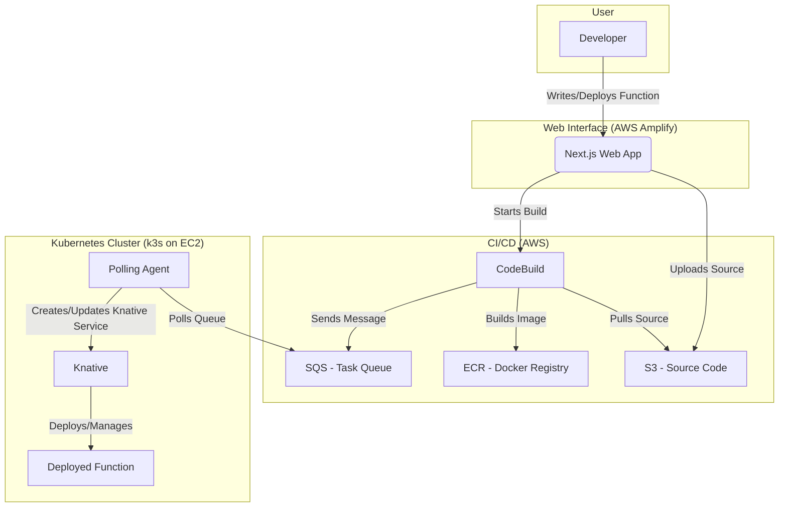

# cutty-x

2025 SoftBank Hackathon in Seoul Final round project

🇰🇷 한국어

## 👋 소개

안녕하세요! 저희는 **Softbank-Hackathon-2025-Team-Green**입니다.

저희는 2025년 소프트뱅크 해커톤을 위해 FaaS(Function-as-a-Service) 플랫폼인 **cutty-x**를 개발하고 있습니다.

## 👥 팀원

| 이름   | 성별 | GitHub                                          | 역할   |
| ------ | ---- | ----------------------------------------------- | ------ |
| 서창덕 | 남성 | [DuckOriDuck](https://github.com/DuckOriDuck)   | (미정) |
| 김홍석 | 남성 | [drghdtjr](https://github.com/drghdtjr)         | (미정) |
| 황서호 | 남성 | [Clear-Wisdom](https://github.com/Clear-Wisdom) | (미정) |
| 정지우 | 여성 | [jiu-jung](https://github.com/jiu-jung)         | (미정) |
| 현진섭 | 남성 | [hjs0410hc](https://github.com/hjs0410hc)       | (미정) |

## 💻 프로젝트 저장소

| 저장소                             | 설명                                                                                                                                                                    |
| ---------------------------------- | ----------------------------------------------------------------------------------------------------------------------------------------------------------------------- |
| [infra](./infra)                   | Terraform Cloud를 사용하여 AWS 인프라(VPC, SG, IAM, Amplify, S3, SQS, ECR, EC2, ASG, NLB, SSM, DynamoDB, Cognito, CodeBuild)를 관리합니다.                              |
| [web](./web)                       | AWS Amplify에서 실행되는 Next.js 풀스택 프로젝트입니다. 사용자가 함수를 작성하고 배포하는 웹 인터페이스를 제공합니다.                                                   |
| [codebuild-repo](./codebuild-repo) | AWS CodeBuild의 빌드 스펙과 유틸리티 스크립트를 포함하는 작업 공간입니다. S3에 업로드된 소스 코드를 컨테이너 이미지로 빌드하고 ECR에 푸시한 후 SQS로 메시지를 보냅니다. |
| [manifest](./manifest)             | k3s 클러스터에서 실행되는 Knative 및 기타 애플리케이션의 Kubernetes 매니페스트를 관리합니다. ArgoCD를 통해 GitOps 방식으로 배포됩니다.                                  |

## ✨ 기술 스택

- **Cloud**: AWS
- **Frontend**: Next.js, React, TypeScript
- **Backend**: Node.js, Knative
- **IaC**: Terraform
- **CI/CD**: AWS CodeBuild, GitHub Actions
- **Container**: Docker, k3s, Cloud Native Buildpacks
- **Orchestration**: Kubernetes, ArgoCD
- **Database**: DynamoDB
- **Authentication**: AWS Cognito

## 🏗️ 아키텍처

🇯🇵 日本語

## 👋 はじめに

こんにちは！私たちは**Softbank-Hackathon-2025-Team-Green**です。

2025 年のソフトバンクハッカソン本選に向けて、FaaS（Function-as-a-Service）プラットフォームである**cutty-x**を開発しています。

## 👥 チームメンバー

| 名前           | 性別 | GitHub                                          | 役割   |
| -------------- | ---- | ----------------------------------------------- | ------ |
| Seo Chang-deok | 男性 | [DuckOriDuck](https://github.com/DuckOriDuck)   | (未定) |
| Kim Hong-seok  | 男性 | [drghdtjr](https://github.com/drghdtjr)         | (未定) |
| Hwang Seo-ho   | 男性 | [Clear-Wisdom](https://github.com/Clear-Wisdom) | (未定) |
| Jeong Ji-woo   | 女性 | [jiu-jung](https://github.com/jiu-jung)         | (未定) |
| Hyun Jin-seop  | 男性 | [hjs0410hc](https://github.com/hjs0410hc)       | (未定) |

## 💻 プロジェクトリポジトリ

| リポジトリ                         | 説明                                                                                                                                                                                                    |
| ---------------------------------- | ------------------------------------------------------------------------------------------------------------------------------------------------------------------------------------------------------- |
| [infra](./infra)                   | Terraform Cloud を使用して AWS インフラ（VPC, SG, IAM, Amplify, S3, SQS, ECR, EC2, ASG, NLB, SSM, DynamoDB, Cognito, CodeBuild）を管理します。                                                          |
| [web](./web)                       | AWS Amplify で実行される Next.js フルスタックプロジェクトです。ユーザーが関数を作成してデプロイするための Web インターフェースを提供します。                                                            |
| [codebuild-repo](./codebuild-repo) | AWS CodeBuild のビルドスペックとユーティリティスクリプトを含むワークスペースです。S3 にアップロードされたソースコードをコンテナイメージにビルドし、ECR にプッシュした後、SQS にメッセージを送信します。 |
| [manifest](./manifest)             | k3s クラスターで実行される Knative およびその他のアプリケーションの Kubernetes マニフェストを管理します。ArgoCD を介して GitOps 方式でデプロイされます。                                                |

## ✨ 技術スタック

- **Cloud**: AWS
- **Frontend**: Next.js, React, TypeScript
- **Backend**: Node.js, Knative
- **IaC**: Terraform
- **CI/CD**: AWS CodeBuild, GitHub Actions
- **Container**: Docker, k3s, Cloud Native Buildpacks
- **Orchestration**: Kubernetes, ArgoCD
- **Database**: DynamoDB
- **Authentication**: AWS Cognito

## 🏗️ アーキテクチャ

🇬🇧 English

## 👋 Introduction

Hello! We are **Softbank-Hackathon-2025-Team-Green**.

We are developing **cutty-x**, a Function-as-a-Service (FaaS) platform for the 2025 SoftBank Hackathon Finals.

## 👥 Team Members

| Name           | Gender | GitHub                                          | Role               |
| -------------- | ------ | ----------------------------------------------- | ------------------ |
| Seo Chang-deok | Male   | [DuckOriDuck](https://github.com/DuckOriDuck)   | (To be determined) |
| Kim Hong-seok  | Male   | [drghdtjr](https://github.com/drghdtjr)         | (To be determined) |
| Hwang Seo-ho   | Male   | [Clear-Wisdom](https://github.com/Clear-Wisdom) | (To be determined) |
| Jeong Ji-woo   | Female | [jiu-jung](https://github.com/jiu-jung)         | (To be determined) |
| Hyun Jin-seop  | Male   | [hjs0410hc](https://github.com/hjs0410hc)       | (To be determined) |

## 💻 Project Repositories

| Repository                         | Description                                                                                                                                                                      |
| ---------------------------------- | -------------------------------------------------------------------------------------------------------------------------------------------------------------------------------- |
| [infra](./infra)                   | Manages AWS infrastructure (VPC, SG, IAM, Amplify, S3, SQS, ECR, EC2, ASG, NLB, SSM, DynamoDB, Cognito, CodeBuild) using Terraform Cloud.                                        |
| [web](./web)                       | A Next.js full-stack project running on AWS Amplify. It provides a web interface for users to write and deploy functions.                                                        |
| [codebuild-repo](./codebuild-repo) | A workspace containing the build spec and utility scripts for AWS CodeBuild. It builds source code from S3 into a container image, pushes it to ECR, and sends a message to SQS. |
| [manifest](./manifest)             | Manages Kubernetes manifests for Knative and other applications running on a k3s cluster. Deployed via GitOps with ArgoCD.                                                       |

## ✨ Tech Stack

- **Cloud**: AWS
- **Frontend**: Next.js, React, TypeScript
- **Backend**: Node.js, Knative
- **IaC**: Terraform
- **CI/CD**: AWS CodeBuild, GitHub Actions
- **Container**: Docker, k3s, Cloud Native Buildpacks
- **Orchestration**: Kubernetes, ArgoCD
- **Database**: DynamoDB
- **Authentication**: AWS Cognito

## 🏗️ Architecture

    
Images 

    
    
    
    
    
    
    
    
    
    
    
    
    
    
    

